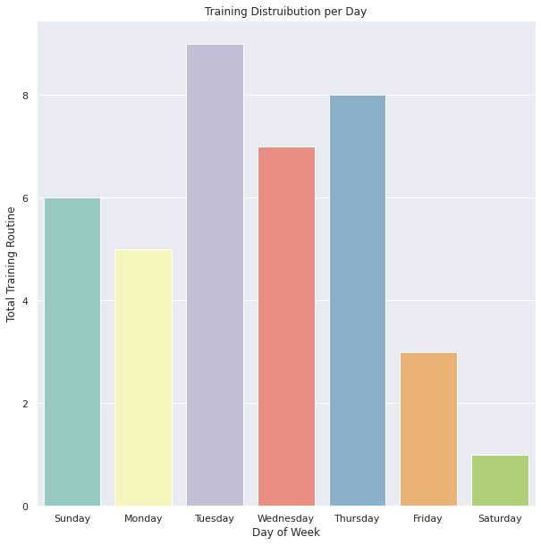
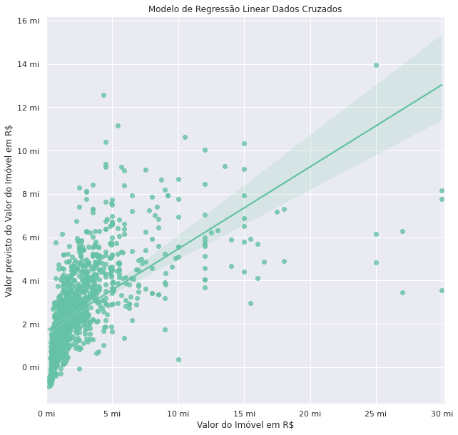
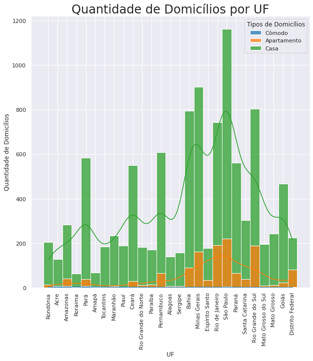

<h1>Welcome to @andreferibeiro Data Science Portfolio</h1>

Please let me introduce myself. My name is **André**, I'm **35** years old. With more than 18 years of experience, for the last 8 years I have been working as Engineer. **Nowadays, I am focused on my plan to conduct a carrer transition to Data Science**. I'm currently on BS degree Data Science program from [**Univesp**](https://univesp.br/) and I believe that my experience with Engineering and Project Management will help me to become a distinguished **Data Scientist**.

My knowledge in **Data Analysis**, **Data Vizualization** and **Machine Learning**, includes:
- Programming: Python, SQL
- Libraries: Pandas, Numpy, Matplotlib, Seaborn, Plotly, Cufflinks, Scikit-learn
- Algorithms: Regression, Classification, Clustering
- Python for Data Science and Machine Learning Bootcamp - Pierian Training (Udemy, 2022)
- Data Immersion #4 (Alura, 2022) ⭐ Project Distinct Award
- IBM Data Science Professional Certification (Coursera/ edX, 2021)

<h2><a href="https://andreferibeiro.github.io/half-marathon-EDA/">Project 1: Half-Marathon Training Exploratory Data Analysis (EDA)</a></h2>

**Project Overview:** Exploratory Data Analysis (EDA) on my Half-Marathon Training Plan provide from Garmin Connect. (**Jun, 2022**) 

   

<h2><a href="https://andreferibeiro.github.io/imersao_dados_alura/">Project A: Data Immersion - Alura</a></h2>

**Project Overview:** Predict through different tools, techniques and databases the value of a property in the city of São Paulo. 
Note: the notebook language is PT-BR. (**May, 2022**)

   

<h2><a href="https://andreferibeiro.github.io/workshop_dados_ebac/">Project B: Workshop Fundamentals of Mathematics for Data Analysis - EBAC</a></h2>

**Project Overview:** Study of the main theoretical concepts and how to interpret some results, especially statistics topics.
Note: the notebook language is PT-BR. (**Jun, 2022**)

   

